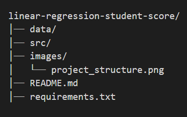

# 🎯 Student Score Prediction using Linear Regression

This is a simple **Machine Learning Project** that predicts student exam scores based on the number of hours studied using **Linear Regression**.

---

## 📂 Project Structure





---

## 🚀 How to Run the Project

1. Clone this repository:
   ```bash
   git clone https://github.com/your-username/linear-regression-student-score.git
   cd linear-regression-student-score

2. Install dependencies:
pip install -r requirements.txt

3. Run the script:
python src/student_score_prediction.py

📊 Output

Scatter Plot showing study hours vs. exam scores.

Regression Line showing best fit.

Prediction Example:
If a student studies 7.5 hours, predicted score ≈ 82.32.


🛠️ Tech Stack

Python
Pandas
Matplotlib
Scikit-Learn

📌 Future Enhancements

Add larger dataset
Build a Flask web app for interactive predictions
Deploy on Streamlit / Hugging Face Spaces